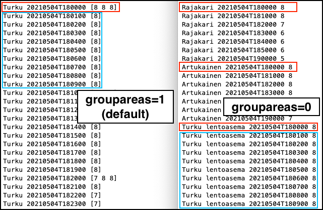

# How To Use the Timeseries API <!-- omit in toc -->

This page describes more indepth the different quesrystring fields and how they
work. For example queries see the [Examples-page](Examples.md).

- [Introduction](#introduction)
- [Request and Response](#request-and-response)
- [Producers](#producers)
- [Requested Locations and Areas](#requested-locations-and-areas)
  - [Single or Multiple Points](#single-or-multiple-points)
  - [Areas](#areas)
  - [Paths](#paths)
  - [WKT (Well Known Text)](#wkt-well-known-text)
  - [Maxdistance](#maxdistance)
- [Time Period](#time-period)
- [Requested Data Values (param)](#requested-data-values-param)
  - [Independent Parameters](#independent-parameters)
  - [Computed Parameters](#computed-parameters)
- [Functions](#functions)
  - [Aggregates With Missing Values](#aggregates-with-missing-values)
  - [Aggregate functions over an area](#aggregate-functions-over-an-area)
  - [Aggregate functions over a time interval](#aggregate-functions-over-a-time-interval)
  - [Aggregate functions over an area and time](#aggregate-functions-over-an-area-and-time)
  - [Filtering Data Before Aggregate](#filtering-data-before-aggregate)
- [Response Formatting](#response-formatting)
  - [Field formats for the response](#field-formats-for-the-response)
  - [Formatting Response Data for Areas](#formatting-response-data-for-areas)
- [Observations](#observations)
  - [Available observation producers](#available-observation-producers)
  - [Sensor number and quality flag](#sensor-number-and-quality-flag)
- [Configuration of Plugin for SmartMet Server](#configuration-of-plugin-for-smartmet-server)
  - [Main configuration file](#main-configuration-file)
  - [Plugin configuration file](#plugin-configuration-file)

## Introduction

The TimeSeries plugin offers a convenient way to fetch the meteorological time
series information over the Web using the HTTP protocol according to a specific
time or time interval chosen by the user. The basic idea is that the HTTP
request contains the parameters needed to obtain the information in response to
a query. In addition, it contains parameters needed for processing the result
and formatting the output.

The TimeSeries plugin can fetch data related to 1) meteorological observations
as well as 2) meteorological forecasts. It fetches the observation data via the
ObsEngine module and the forecast data is fetched via the QEngine module. So,
these modules should be in place when using the TimeSeries plugin.

It is good to realize that the TimeSeries plugin queries meteorological data
according to the data locations and the timestamps, but not according to the
actual data values. For example, you can request data (observations or
forecasts) from a location X in the time interval T1 to T2. However, you cannot
request data records for  which data field X has values in a specific range V1
to V2.

## Request and Response

A typical TimeSeries request contains the following parameters:

- Data source or service location
- Requested geographical location, area or path
- Requested time range (start time, end time)
- Response (output) format (ASCII, XML, HTML, etc.)
- Output fields and formats

The URL of the HTTP request contains the  parameters that have to be delivered
to the TimeSeries plugin. For example, the following request fetches the
temperature forecasted for the city of Turku:

```text
http://data.fmi.fi/timeseries?format=debug&place=Turku&param=name,time,temperature
```

The request query starts with a "service location", and is followed by one or
more parameters given as name-value pairs separated by the ampersand (&)
character. The format of the parameters is similar to that of  HTTP GET request.

A typical  response could be  the following:

| name  | time            | temperature |
| ----- | --------------- | ----------- |
| Turku | 20160907T110000 | 19          |
| Turku | 20160907T120000 | 20          |
| Turku | 20160907T130000 | 20          |

The TimeSeries plugin uses these parameters to call the QEngine or the ObsEngine
that provides the actual query interface needed to access the meteorological
time series data.  Please note that if the 'service location' is `data.fmi.fi`,
then you have to provide your `fmi_apikey` to get the data requested. There is also
the `opendata.fmi.fi` service that can be used without an apikey. Most data is also
available from this open service.

The TimeSeries plugin returns a  HTTP error message such as "Bad Request",
"Wrong parameters" etc. to the client if the request process fails.

## Producers

Generally meteorological information is obtained from different sources or they
are generated using different forecast models. In this document we refer to
these sources as producers and different producers produce different kinds of
information. For example, some producers may produce information related to air
and weather (temperature, pressure, wind,  rain, etc) whereas some others may
produce information related to seas and lakes (temperature, water level, ice
cover, etc.). It is also possible that some producers provide only
meteorological observations whereas some others also provide meteorological
forecasts. So the user when requesting the data using the TimeSeries plugin
should be aware of the available producers and about the data they are
producing.

The name(s) of the producer(s) can be defined using the 'producer' parameter in
the request. If no producer is defined then the QEngine/ObsEngine module tries
to find a valid data based on the requested location.

TimeSeries plugin can fetch data from several producers using a single request
by giving the names of the producers separated by a comma (e.g.
producer=fmi,hirlam') or a semicolon(e.g. producer=fmi;road). The semicolon is
used to separate the producers in time whereas the comma separates the producers
by area.

## Requested Locations and Areas

Meteorological information is usually bounded to a certain geographical area or
a location. This means that almost all meteorological records contain location
coordinates. In order to query this kind of information, we have to define the
geographical location(s) or the area(s) from where we want to get the data. As
long as the location information is stored in using coordinates, the simplest
way to fetch the meteorological data is to use the coordinates in the request.

When using the coordinates, the most challenging task is to define the
coordinates of the geographical area from where we want to fetch the
information. It is not difficult to define the coordinates if the area is
circular or rectangular in shape. But in many cases  the requested area is
polygon-shaped  as in the case of city borders or lakes, it is challenging to
define the exact coordinates. So usually for the polygon-shaped areas, the
coordinates are predefined in a database that can be referenced by a location
name  or an identifier (id) and it is enough to give  the location name or the
id when  requesting the data for these areas using the TimeSeries plugin. The
TimeSeries plugin uses the location name or the id  to fetch the actual
coordinates from the PostGIS database and  it uses these coordinates to  query
the  information from the QEngine/ObsEngine modules.

### Single or Multiple Points

In this context, a location refers to a certain point or a place with
geographical coordinates. When requesting meteorological data with a location we
probably want to get data from a certain meteorological station for which we
know the coordinates, name or id.

If we want to get the meteorological data around a given location, we need to
provide the coordinates of the center of the geographical area and  the radius
which defines how wide the circular area is to the TimeSeries plugin request.
If the radius is missing then the location refers to the coordinates. The radius
can be defined as a part of the location parameter value separated by a colon(:)
character.

The following parameters can be used to define geographical locations(s) when
requesting data from the TimeSeries plugin. Examples are in parentheses.

| Parameter | Description                                                                                                                                                                                                          |
| --------- | -------------------------------------------------------------------------------------------------------------------------------------------------------------------------------------------------------------------- |
| place     | The requested geographical location expressed by the location name (`place=Helsinki`)                                                                                                                                |
| places    | The list of the requested geographical locations expressed by the location names (`places=Helsinki,Turku,Tampere`.                                                                                                   |
| lonlat    | The requested geographical location expressed by the longitude and the latitude coordinates (`lonlat= 24.94,60.17`)                                                                                                  |
| x,y,crs   | The requested geographical location expressed by x-coordinate,y-coordinate and crs (`&x=3386583.4&y=6679159.1&crs=EPSG:2393`)                                                                                        |
| lonlats   | The requested geographical location expressed by the longitude and the latitude coordinates (`lonlats=24.94,60.17,22.27,60.45,23.76,61.50`)                                                                          |
| latlon    | The requested geographical location expressed by the latitude and the longitude coordinates (`latlon=60.17,24.94`)                                                                                                   |
| latlons   | The list of requested geographical locations expressed by the latitude and the longitude coordinates (`latlons=60.17,24.94,60.45,22.27,61.50,23.76`)                                                                 |
| height    | Requested height in meters                                                                                                                                                                                           |
| heights   | List of heights in meters                                                                                                                                                                                            |
| pressure  | Requested pressure level in hPa                                                                                                                                                                                      |
| pressures | List of pressures in hPa                                                                                                                                                                                             |
| keyword   | The requested geographical location expressed by a keyword. The keywords are stored in the Location Database and fetched via GeoEngine module, and depend on the contents of the database (`keyword=finnish_cities`) |
| inkeyword | List of keywords into which location searches will be restricted to                                                                                                                                                  |
| geoid     | The requested geographical location expressed by the unique location identifier. Depend on the contents of the database. (`geoid=658226`)                                                                            |
| geoids    | The list of geographical locations expressed by the unique location identifiers (`geoids=658226,773222,124422`)                                                                                                      |
| feature   | An optional comma separated list of feature codes for limiting coordinate searches (`feature=SYNOP` or `feature=PPL,PPLX,SYNOP`)                                                                                     |

Example 1

The location is expressed by the city name (Turku) and the radius of the area is
20 kilometers. The coordinates of the place "Turku" are fetched from the
GeoEngine module.

```text
http://data.fmi.fi/timeseries?producer=opendata&place=Turku:20&param=name,time,temperature,pressure
```

Example 2

The location is expressed by the  coordinates (longitude = 24.94, latitude  =
60.17)  and the radius of the area is 15 kilometers.

```text
http://data.fmi.fi/timeseries?producer=opendata&lonlat=24.94,60.17:15&param=name,time,temperature,pressure
```

Example 3

The location is expressed by the geoid (658226) which refers to the location id
in the Location Database. The information about the of the place is fetched from
the GeoEngine module. As there is no  radius parameter in the query, the
information of the place covers only the given coordinates but not any wider
area.

```text
http://data.fmi.fi/timeseries?producer=opendata&geoid=658226&param=name,time,temperature,pressure
```

### Areas

When requesting data from a certain geographical area we need to define borders
of  this area. Usually a geographical area can have very complex shape (city
borders, lakes, state borders, etc.), so the area is usually defined as a
polygon with several coordinate points.

At the moment, the TimeSeries plugin does not directly support polygon
coordinates in the request. So one has to give the  area name and the
TimeSeries plugin  fetches the area coordinates from the PostGIS database that
are  used for querying data from the QEngine/ObsEngine module.

The coordinates can be given directly in the request only when the requested
area is rectangular in shape. In this case the area is defined by the
coordinates of the opposite corners of the rectangle.

When querying data for a geographical area, we may get the  fields as a
value-array as shown in the table below instead of a single value and these
values correspond to the values at the actual grid points.

| name  | time            | temperature   |
| ----- | --------------- | ------------- |
| Turku | 20160913T140000 | [19 20 20 20] |
| Turku | 20160913T150000 | [20 20 20 20] |
| Turku | 20160913T160000 | [20 20 20 20] |

If we want to get just one value per field, we have to use aggregate functions
such as min. max. mean, etc. to calculate the value we want. The usage of these
functions are described later in the section on
[Functions](https://github.com/fmidev/smartmet-plugin-timeseries/wiki/TimeSeries-plugin#functions).

The following parameters can be used to define the geographical area(s) when
requesting data using the TimeSeries plugin.

| Parameter | Description                                                                                                       |
| --------- | ----------------------------------------------------------------------------------------------------------------- |
| area      | The requested geographical area expressed by the area name (e.g. "Helsinki")                                      |
| areas     | The list of the requested geographical areas expressed by the area names (e.g."Helsinki,Turku,Tampere,Rovaniemi") |
| bbox      | The requested geographical area expressed as the bounding box coordinates                                         |

Example 1

The area is expressed by the city name (Turku). The actual polygon coordinates
are fetched from the PostGIS database by using the city name.

```text
http://opendata.fmi.fi/timeseries?producer=opendata&area=Turku&param=name,time,temperature
```

Example 2

The area is expressed by the city name (Turku). The actual polygon coordinates
are fetched from the PostGIS database by using the city name. The requested area
is expanded to 10 kilometers around  the given polygon.

```text
http://data.fmi.fi/timeseries?producer=opendata&area=Turku:10&param=name,time temperature,pressure
```

Example 3

The location is expressed by the bounding box with coordinates (24.14,60.17 -
25.14,61.17). As there is no value for radius given  in the query the location
covers only the given coordinates.

```text
http://opendata.fmi.fi/timeseries?producer=opendata&bbox=24.14,60.17, 25.14,61.17&param=name,time,temperature,pressure
```

### Paths

Sometimes meteorological information is needed along a certain  geographical
path such as roads, ferry routes, flight paths, etc. Providing the list of
coordinates for a path is  technically viable but the TimeSeries  uses
predefined path names as the list of coordinates  can be quite long for some
paths.  It fetches the path coordinates from the PostGIS database based on  the
path names  and uses these coordinates to query  the ObsEngine or QEngine
modules for the data.

The following parameters can be used in order to define geographical path(s)
when requesting data using the TimeSeries plugin:

| Parameter | Description                                                                                                                  |
| --------- | ---------------------------------------------------------------------------------------------------------------------------- |
| path      | The requested geographical path expressed by the location name or by the coordinate list.                                    |
| paths     | The list of the requested geographical paths expressed by the location names.                                                |
| step      | This parameter indicates the interval between the forecast points in the path. The default unit of the step  is 1 kilometer. |

Example 1

The path is expressed by the city name (Turku). In this case the path follows
the city borders. The  path coordinates are fetched from the PostGIS database by
using the city name.

```text
http://data.fmi.fi/timeseries?producer=opendata&path=Turku&param=time,temperature,pressure
```

Example 2

The path is expressed by the list of coordinates (longitude/latitude pairs).
This is a direct path "Helsinki-Turku-Tampere".

```text
http://data.fmi.fi/timeseries?producer=opendata&path=24.94,60.17,22.27,60.45,23.76,61.50 &param= time,temperature
```

Example 3

The path is expressed by the list of city names (Helsinki, Turku, Tampere). In
this case we have three paths that follows the city borders. This is not a
direct path "Helsinki-Turku-Tampere".

```text
http://data.fmi.fi/timeseries?producer=opendata&paths=Helsinki,Turku,Tampere&param=time,t2m
```

Example 4

The path is expressed by the road number (4). This is a highway from Helsinki to
Utsjoki. The actual path coordinates are fetched from the PostGIS database by
using the road number. The data is requested for every 10 kilometers interval
and this is expressed by the parameter "step".

```text
http://data.fmi.fi/timeseries?producer=opendata&path=4&step=10&param=time,temperature,pressure
```

### WKT (Well Known Text)

The following wkt-geometries are supported:

- POINT
- POLYGON
- LINESTRING
- MULTIPOINT
- MULTIPOLYGON
- MULTILINESTRING

POINT is handled just like lonlat-, latlon- and place-parameter.

LINESTRING is handled just line path-parameter.

Example 1

Temperature and pressure for Helsinki city center.

```text
http://data.fmi.fi/timeseries?producer=pal&wkt=POINT(24.93545+60.16952)&param=time,temperature,pressure
```

Example 2

Name is defined for geometry, otherwise same as example 1.

```text
http://data.fmi.fi/timeseries?producer=pal&wkt=POINT(24.93545+60.16952) as Helsinki city center&param=time,name,temperature,pressure
```

Example 3

Minimum, maximum, mean temperature for area.

```text
http://data.fmi.fi/timeseries?producer=pal&wkt=POLYGON((27.005862495386964+61.52202816304436,26.599368354761964+61.506308658387724,26.522464057886964+61.28539963729424,26.775149604761964+61.02170117554813,27.752932807886964+61.192892526551304,27.005862495386964+61.52202816304436))&param=time,min_a(temperature),max_a(temperature),mean_a(temperature)
```

Example 4

Minimum, maximum, mean temperature for a path.

```text
http://data.fmi.fi/timeseries?producer=pal&wkt=LINESTRING(27.005862495386964+61.52202816304436,26.599368354761964+61.506308658387724,26.522464057886964+61.28539963729424,26.775149604761964+61.02170117554813,27.752932807886964+61.192892526551304,27.005862495386964+61.52202816304436)&param=time,min_a(temperature),max_a(temperature),mean_a(temperature)
```

### Maxdistance

Maxdistance parameter can be used in querydata requests to indicate how far away from the given location the data can be fetched. In observation requests it indicates how far away from the given location the observation station can be.

Maxdistance is either plain number or number+units, e.g 10km. Valid units are:

| Unit | Description   | Example    |
| ---- | ------------- | ---------- |
| km   | kilometer     | 10km       |
| m    | meter         | 10000m     |
| cm   | centimeter    | 1000000cm  |
| mm   | millimeter    | 10000000mm |
| mi   | mile          | 10mi       |
| nmi  | nautical mile | 10nmi      |
| yd   | jard          | 17600yd    |
| ft   | foot          | 52800ft    |
| in   | inch          | 633600in   |

If maxdistance is plain number it is interpreted as kilometers in querydata requests (e.g. maxdistance=10) and as meters in observation requests (e.g maxdistance=10000)

## Time Period

Meteorological data whether it is observations or forecasts made over a certain
time period. So meteorological data can be  requested over a certain time period
or by specifying the exact time.

The TimeSeries plugin needs exact time period for querying data from the
QEngine/ObsEngine module. Usually this time period is given in the HTTP request
when the data is requested. If not, the TimeSeries plugin uses the default
values. The simplest way to define the time period is by using "starttime" and
"endtime" parameters. These parameters support the following time formats:

- YYYYMMDDTHHMISS ('T' is date/time separator)
- YYYYMMDDHHMI
- YYYY-MM-DD HH:MI:SS
- YYYY-MM-DDTHH:MI:SS ('T' is date/time separator)
- +-NNNNx (Time increase/decrease. 'x' is unit of time expressed in m=minutes, h=hours, d =days)

In addition, the value "data" implies the setting is taken from the selected
producer directly. If the data is loaded into querydata-engine in multifile
mode, the start time shall be the first time in the first file loaded into
memory.

Another way to define the time period is to use the "starttime", "timestep", and
"timesteps" parameters. Here, the "timestep" parameter defines the time interval
between the requested records and the "timesteps" parameter defines  how many
data records  are requested. The actual end time can be easily calculated from
this information as endtime = startime + timesteps x timestep.

Alternatively, value "data" can be used for the "timestep" parameter to select
the exact timesteps available in the data.

The following parameters can be used to define the time period and possible time
intervals for the requested data:

| Parameter  | Description                                                                                                                                                                                                                                                                                                                                                                                                                                                                                    |
| ---------- | ---------------------------------------------------------------------------------------------------------------------------------------------------------------------------------------------------------------------------------------------------------------------------------------------------------------------------------------------------------------------------------------------------------------------------------------------------------------------------------------------- |
| starttime  | The start time of the requested time period. If this parameter is missing then the query uses the default value, which is the next full hour counted from the current time.                                                                                                                                                                                                                                                                                                                    |
| endtime    | The end time of the requested time period. If this parameter is missing then the end time is start time plus 24 hours.                                                                                                                                                                                                                                                                                                                                                                         |
| timestep   | The time interval between the requested data (observations/forecasts). The default value is 60 minutes.                                                                                                                                                                                                                                                                                                                                                                                        |
| timesteps  | The number of data records are  requested (observations/forecasts). This is an alternative way to define the end time. Here  the end time can be calculated as start time + time steps x time step interval.                                                                                                                                                                                                                                                                                   |
| hour       | The requested times are  expressed as a list of hours (e.g. "12,13,18,19")                                                                                                                                                                                                                                                                                                                                                                                                                     |
| time       | The requested times are expressed as a  list of hours and minutes (e.g. “1200,1230,1315”)                                                                                                                                                                                                                                                                                                                                                                                                      |
| tz         | The time zone used in the request and the response times. The default value is the special value "localtime", meaning the actual timezone may change for each requested location.                                                                                                                                                                                                                                                                                                              |
| origintime | This parameter can be used when requesting forecast information and  is used to select a model run based on its origin time. The requested query should be executed against the data set for which the creation time is closest to the origin time. If the parameter is missing the query is executed against the latest data set. The point is that there might be several meteorological forecasts in place and with this parameter we can define which one to use based on its origin time. |

Example 1

The start time of the time period is expressed with the "starttime" parameter.
If  end time is not given,  the default end time is start time + 24h.

```text
http://data.fmi.fi/timeseries?producer=opendata&place=Turku&starttime=20160407090000&param=time,temperature,pressure
```

Example 2

The start time of the time period is expressed with the "starttime" parameter
and the end time with the "endtime" parameter.

```text
http://data.fmi.fi/timeseries?producer=opendata&place=Turku&starttime=20160407090000&endtime=201604070180000 &param=time,temperature,pressure
```

Example 3

The start time of the time period is expressed with the "starttime". We are
requesting 10 records with time interval of 30 minutes. So, the end time is
start time + 10 x 30 minutes.

```text
http://data.fmi.fi/timeseries?producer=opendata&place=Turku&starttime=20160407090000&timestep=30&timesteps=10 &param=time,temperature,pressure
```

Example 4

We are requesting records according to a list of times expressed by hours and
minutes.

```text
http://data.fmi.fi/timeseries?producer=opendata&place=Turku&time=0900,0915,0940,1000,1025&param=time, temperature
```

## Requested Data Values (param)

As mentioned earlier, the actual data fields that can be requested  from the
TimeSeriers plugin depends on the available data producers. In this document we
assume that the user already know the available producers and the data fields
that they are supporting.

The simplest way to fetch the data fields is just to list their names in the
value of the `param` querystring field. For example:

```text
http://data.fmi.fi/timeseries?producer=opendata&place=Turku&param=time,temperature,pressure
```

This would return a list of times of the forecast along with the predicted temperature and
air pressure for the location.

### Independent Parameters

It is possible to  request the data fields (parameters) that the TimeSeries
plugin automatically generates based on the timestamp, the selected location,
etc., and also the data fields that are independent of the data. The first table
contains the parameters that can be generated  independent of the data and the
second table contains parameters that have to be computed either from the data
or by using other parameters. So we name the parameter of the first table as
"independent parameter" and that of the second table as "computed parameter".

| Independent Parameter | Description                                                                                                                                                   | Forecast | Observation | Note!                                    |
| --------------------- | ------------------------------------------------------------------------------------------------------------------------------------------------------------- | -------- | ----------- | ---------------------------------------- |
| level                 | The level value of the requested fields.                                                                                                                      | X        | -           |
| latitude              | The latitude of the geographical location.                                                                                                                    | X        | X           |
| longitude             | The longitude of the geographical location.                                                                                                                   | X        | X           |
| y+crs                 | The y-coordinate of the geographical location, expressed in requested Coordinate Reference System.                                                            | X        | X           | If crs is missing latitude is returned.  |
| x+crs                 | The x-coordinate of the geographical location, expressed in requested Coordinate Reference System.                                                            | X        | X           | If crs is missing longitude is returned. |
| lonlat                | The longitude and the latitude of the geographical location.                                                                                                  | X        | X           |
| latlon                | The latitude and the longitude of the geographical location.                                                                                                  | X        | X           |
| nearlatitude          | Last used latitude.                                                                                                                                           | X        | X           |
| nearlongitude         | Last used longitude.                                                                                                                                          | X        | X           |
| nearlonlat            | Last used longitude and latitude.                                                                                                                             | X        | X           |
| nearlatlon            | Last used latitude and longitude.                                                                                                                             | X        | X           |
| elevation             | The elevation of the geographical location expressed in meters.                                                                                               | X        | X           |
| sunelevation          | The angle of the sun's elevation.                                                                                                                             | X        | X           |
| sundeclination        | The angle of the sun's declination.                                                                                                                           | X        | X           |
| sunazimuth            | The angle of the sun azimuth.                                                                                                                                 | X        | X           |
| dark                  | Darkness indicator (1 = dark, 0 = not dark)                                                                                                                   | X        | X           |
| sunrise               | Time of the local sunrise.                                                                                                                                    | X        | X           |
| sunset                | Time of the local sunset.                                                                                                                                     | X        | X           |
| noon                  | Time of the local noon.                                                                                                                                       | X        | X           |
| sunrisetoday          | Sunrise indicator (1 = the sun rises today, 0 = the sun will not rise today)                                                                                  | X        | X           |
| sunsettoday           | Sunset indicator (1 = the sun goes down today, 0 = the sun will not go down  today)                                                                           | X        | X           |
| daylength             | The length of the day expressed in minutes.                                                                                                                   | X        | X           |
| moonphase             | The illumination fraction of the moon.                                                                                                                        | X        | X           |
| moonrise              | Time of the local moonrise.                                                                                                                                   | X        | X           |
| moonrise2             | Time of the local moonrise (if there is an earlier moonrise in the same day)                                                                                  | X        | X           |
| moonset               | Time of the local moonset.                                                                                                                                    | X        | X           |
| moonset2              | Time of the local moonset (if there is an earlier moonset in the same day)                                                                                    | X        | X           |
| moonrisetoday         | Moonrise indicator (1 = the moon rises today, 0 = the moon will  not rise today)                                                                              | X        | X           |
| moonrise2today        | Moonrise indicator (1 = the moon rises twice today, 0 = the moon will not rise twice today)                                                                   | X        | X           |
| moonsettoday          | Moonset indicator (1 = the moon goes down today, 0 = the moon will not go down today)                                                                         | X        | X           |
| moonset2today         | Moonset indicator (1 = the moon goes down twice today, 0 = the moon will not  go down twice today)                                                            | X        | X           |
| moonup24h             | Moon up indicator (1 = the moon is up all day, 0 = the moon is not up all day)                                                                                | X        | X           |
| moondown24h           | Moon down indicator (1 = the moon is down all day, 0 = the moon is not down all day)                                                                          | X        | X           |
| time                  | Local time in the selected time zone. The format can be specified with the "timeformat" parameter.                                                            | X        | X           |
| localtime             | Local time (ignoring the tz option). The format can be specified with the "timeformat" parameter.                                                             | X        | X           |
| utctime               | UTC time (ignoring the tz option). The format can be specified with the "timeformat" parameter.                                                               | X        | X           |
| origintime            | Origin time in the selected time zone. The format can be specified with the "timeformat" parameter.                                                           | X        | X           |
| modtime               | Modification time in the selected time zone. The format can be specified with the "timeformat" parameter.                                                     | X        | X           |
| mtime                 | Same as "modtime".                                                                                                                                            | X        | X           |
| epochtime             | Unix epoch time (the number of seconds that have elapsed since January 1, 1970)                                                                               | X        | X           |
| isotime               | Local time in the selected time zone expressed in the ISO format (YYYYMMDDTHHMISS)                                                                            | X        | X           |
| xmltime               | Local time in the selected time zone expressed in the XML format (YYYY-MM-DDTHH:MI:SS)                                                                        | X        | X           |
| wday                  | The abbreviation of the week day (Sun, Mon, etc.). The used language can be set by the "locale" parameter (e.g.  locale=fi_FI)                                | X        | X           |
| weekday               | The name of the week day (Sunday, Monday, etc.). The used language can be set by the "locale" parameter (e.g.  locale=fi_FI)                                  | X        | X           |
| mon                   | The abbreviation of the month name (Jan, Feb, etc.). The used language can be set by the "locale" parameter (e.g. , locale=fi_FI)                             | X        | X           |
| month                 | The name of the month (January, February, etc.). The used language can be set by the "locale" parameter (e.g.  locale=fi_FI)                                  | X        | X           |
| place                 | The name of the place that was used in the "place" parameter. If the parameter was not used then this contains the location coordinates (longitude, latitude) | X        | X           |
| stationname           | The official name of the observation station.                                                                                                                 | X        | X           |
| stationlon            | The longitude of the station.                                                                                                                                 | X        | X           |
| stationlat            | The latitude of the station.                                                                                                                                  | X        | X           |
| stationgroups         | Limit the set of acceptable stations for the producer further. For example stationgroups=AWS,SYNOP will omit precipitation stations, radars etc.              | X        | X           |
| distance              | The distance to the station.                                                                                                                                  | X        | X           |
| name                  | The name of the location. This information was returned by the GeoEngine module according to the location coordinates.                                        | X        | X           |
| geoid                 | The geo-id of the location. This information was returned by the GeoEngine module according to the location coordinates.                                      | X        | X           |
| country               | The name of the country. This information was returned by the GeoEngine module according to the location coordinates.                                         | X        | X           |
| iso2                  | The ISO country code. This information was returned by the GeoEngine module according to the location coordinates.                                            | X        | X           |
| region                | The name of the region. This information was returned by the GeoEngine module according to the location coordinates.                                          | X        | X           |
| tz                    | Time zone used in the time field.                                                                                                                             | X        | X           |
| localtz               | Time zone of the geographical location.                                                                                                                       | X        | X           |
| gridnorth             | Direction of north in the grid location.                                                                                                                      | X        | -           |

If option "findnearestvalidpoint=1" is used, and the data has been
marked in the querydata engine not to be full with "fullgrid=false",
the nearest valid point in the data will be searched if necessary
using the given "maxdistance" condition. The default "maxdistance" is
"60.0km". If a valid point is found nearby, "nearlongitude" and
similar parameters will store the actual coordinate used.

This feature is thought to be useful for example when trying to
establish wave heights at the shore simply by specifying the name of
the harbour or the city.

### Unique Parameter Keys
When forecast data is requested from the grid-engine (instead of the querydata-engine) it is quite typical that the same parameter name refers to several grids. For example, if we request "Temperature" parameter without any additional details we get values from grids that use default values for the details that are needed in order to uniquely identify the requested data. The point is that we have millions of different grids with different parameter names, producers, geometries, level types, levels, forecast types and forecast numbers. So, if we want to find exact data we need to use exact parameter keys instead of simple parameter names.

When requesting data from the grid-engine, we can use parameter keys like "T-K:MEPS:1093:6:2:3:1", where:

| Field | Description                                            |
| ------| ------------------------------------------------------ |
| 1     | Parameter name (T-K = Temperature in Kelvins)          | 
| 2     | Producer name (MEPS)                                   | 
| 3     | Number of the grid geometry (1093 = Scandinavian area) | 
| 4     | Level type (6 = Height above ground)                   |
| 5     | Level (2  = 2 meters)                                  |
| 6     | Forecast type (3 = Enseble forecast)                   |
| 7     | Forecast number (1 = 1st Ensemble member)              |

A parameter key can contain all parameter details (including the producer name), which means that we can use parameters from multiple producers and multiple levels with the same request. 

For example, the following request fetches temperature values from two different producers (SMARTMETNWC,ECMOSKRIGING)

```text
smartmet.fmi.fi/timeseries?place=espoo&format=debug&param=name,time,T-K:SMARTMETNWC::6:2,Temperature:ECMOSKRIGING::6:2
```
Notice, that we can also leave some field empty when there are no multiple values avaiable for the current field. In the previous example, we left the third field (= geometry number) empty, because these producers do not have multiple grid geometries.

It is also good to notice that if we are using "traditional" parameter names like "Temperature" instead of new names like "T-K", it usually means that the original data (= Temperature in Kelvins) is converted (Kelvin => Celcius) during the request. These conversions are defined in the SmartMet Server configuration / mapping files. The same files are used in order to define interpolation methods for different parameters. For example, temperature values are usully interpolated linearly, meanwhile direction parameters (like wind directions) are not necessary interpolated at all (i.e. the request picks the value from the nearest grid point).

The easies way to find out unique parameter keys is to use the grid-gui-plugin.


### Additional Parameters
When forecast data is requested from the grid-engine (instead of the querydata-engine) there are some additional parameters available that can be used in order to find out more information about the returned data. These additional parameters are needed because we can request data from multiple producers, geometries and levels at the same time. So, in these cases it does make sense to use 'producer', 'origintime' or 'level' parameters, because this information is not necessary same for all of the parameters.

If we want to get more information about the requested parameters, we can use the following additional parameters:

| Parameter           | Description                                                                                                                                                                                                                                                                                  |
| ------------------- | -------------------------------------------------------------------------------------------------------------------------------------------------------------------------------------------------------------------------------------------------------------------------------------------- |
| @I-N                | The unique parameter key (FMI key) of the parameter in the field/column N.                                                                                                                                                                                                                             |
| @P-N                | The producer name of the parameter in the field/column N.                                                                                                                                                                                                                                    |
| @G-N                | The generation name of the parameter in the field/column N.                                                                                                                                                                                                                                  |
| @GM-N               | The geometry identifier of the parameter in the field/column N.                                                                                                                                                                                                                              |
| @LT-N               | The level type of the parameter in the field/column N.                                                                                                                                                                                                                                       |
| @L-N                | The level value of the parameter in the field/column N.                                                                                                                                                                                                                                      |
| @FT-N               | The forecast type of the parameter in the field/column N.                                                                                                                                                                                                                                    |
| @FN-N               | The forecast number of the parameter in the field/column N.                                                                                                                                                                                                                                  |
| @AT-N               | The analysis time of the parameter in the field/column N.                                                                                                                                                                                                                                    |

The 'N' is the index of the field/column that contains the parameter that we are investigating. The leftmost / first index is 0 (zero), which means that the index of the 2nd field/column is 1.

Example 1

```text
smartmet.fmi.fi/timeseries?place=espoo&format=debug&param=name,time,Temperature:SMARTMETNWC,@I-2,@P-2,@G-2,@GM-2,@LT-2,@L-2,@FT-2,,@FN-2,@AT-2
```

Example 2

```text
smartmet.fmi.fi/timeseries?place=espoo&format=debug&param=name,time,T-K:SMARTMETNWC,T-K:ECMOSKRIGING,Temperature:MEPS,@I-2,@I-3,@I-4
```


### Computed Parameters

The table with the computed parameters is given below.

| Computed Parameter  | Description                                                                                                                                                                                                                                                                                  |
| ------------------- | -------------------------------------------------------------------------------------------------------------------------------------------------------------------------------------------------------------------------------------------------------------------------------------------- |
| WindCompass8        | The wind direction expressed in 8 main wind directions (N,NE,E,...,NW)                                                                                                                                                                                                                       |
| WindCompass16       | The wind direction expressed in 16 main wind directions.                                                                                                                                                                                                                                     |
| WindCompass32       | The wind direction expressed in 32 main wind directions.                                                                                                                                                                                                                                     |
| Cloudiness8th       | The cloud cover expressed by value range 0 - 8 (0 = no clouds, 8 = fully covered)                                                                                                                                                                                                            |
| ApparentTemperature | The "feel like" temperature calculated from the temperature, the relative humidity and the wind speed values.                                                                                                                                                                                |
| FeelsLike           | Same as "ApparentTemperature".                                                                                                                                                                                                                                                               |
| WindChill           | The wind chill in degree Celsius.                                                                                                                                                                                                                                                            |
| SummerSimmerIndex   | Effect of heat on how the temperature feels like.                                                                                                                                                                                                                                            |
| SSI                 | Same as "SummerSimmerIndex".                                                                                                                                                                                                                                                                 |
| Weather             | Text description of the weather like "heavy rain", "sunny", "partly cloudy", etc. These descriptions are available in the following languages: Finnish (fi), English(en), Swedish (sv), Estonian (et). You can define the language in the request with the "lang" parameter (e.g. "lang=en") |
| SmartSymbol         | The new weather symbol code used at FMI.                                                                                                                                                                                                                                                     |
| SmartSymbolText     | Plain text for the SmartSymbol.                                                                                                                                                                                                                                                              |

Example 1

This request fetches values for the following fields: name, time, temperature,
WindCompass8.

```text
http://opendata.fmi.fi/timeseries?producer=opedatadata&place=Turku&param=name,time,temperature,WindCompass8
```

## Functions

TimeSeries plugin supports some aggregate  functions that can be  applied to
specific data fields of the queried data. As we have seen in the section on
[Area](https://github.com/fmidev/smartmet-plugin-timeseries/wiki/TimeSeries-plugin#area),
when we request the temperature over a geographical area, the TimeSeries plugin
may return the temperature values at the grid points of the area as a list. We
can specify a function "mean(temperature)" as a parameter to obtain the mean
temperature over the specified geographical area. The requested data fields can
be aggregated 1) over an area, 2) over a time interval, or 3) over both the time
interval and the area.

### Aggregates With Missing Values

When the data contains missing values, the aggregate functions fail to produce
any results. To fix this all functions have variants which allow missing/nan
values to exist in the aggregated data. These variants can be used by adding
`nan` prefix to the function name.

For example

```text
mean(temperature)
```

would become

```text
nanmean(temperature)
```

Using the nan-functions is especially needed when aggregating obseravations
which often contain missing values.

### Aggregate functions over an area

The following aggregate functions can be used to calculate the aggregate values
over a given geographical area

| Function                    | Description                                                                                                                                                                   |
| --------------------------- | ----------------------------------------------------------------------------------------------------------------------------------------------------------------------------- |
| median(field)               | The median value of the field evaluated over the given area.                                                                                                                  |
| mean(field)                 | The mean value of the field evaluated over the given area.                                                                                                                    |
| circlemean(field)           | The circular mean value of a direction parameter over the given area or time.                                                                                                 |
| min(field)                  | The minimum value of the field in the given area.                                                                                                                             |
| max(field)                  | The maximum value of the field in the given area.                                                                                                                             |
| sum(field)                  | The sum of the field values calculated over the given area.                                                                                                                   |
| integ(field)                | The weighted sum of the field values calculated over the given area. Duration is used as the weight.                                                                          |
| sdev(field)                 | The standard deviation of the field values calculated over the given area.                                                                                                    |
| trend(field)                | The trend of the field values calculated over the given area.                                                                                                                 |
| change(field)               | The change of the field values calculated over the given area.                                                                                                                |
| count\[min:max](field)      | The number of the field values in the given range (min..max) calculated  over the given area. The function returns the total number of the field values if no range is given. |
| percentage\[min:max](field) | The percentage of the field values in the given range (min..max) calculated over the given area. The function return 100 (%) if no range is given.                            |

Example

The following query gets the minimum, maximum and mean temperature of a given
area. Note that the query returns the temperature at the grid points of the area
as well as  the min, max and mean of the temperature of a given area.

```text
http://opendata.fmi.fi/timeseries?format=debug&area=Turku&param=name,time,min(temperature) as mintemp,max(temperature) as maxtemp ,mean(temperature) as meantemp
```

The response of this query can be as follows.

| name  | time            | temperature   | mintemp | maxtemp | meantemp |
| ----- | --------------- | ------------- | ------- | ------- | -------- |
| Turku | 20160913T160000 | [19 20 20 20] | 19      | 20      | 20       |
| Turku | 20160913T170000 | [19 19 19 19] | 19      | 19      | 19       |
| Turku | 20160913T180000 | [18 19 18 18] | 18      | 19      | 18       |

### Aggregate functions over a time interval

Aggregate functions over a time interval help to apply a function on  a field
over a time interval. The following aggregate  functions can be used in order to
calculate aggregate values over the given time interval. The 'btime' and 'atime'
parameters define the time range around the time steps. The 'btime' indicates
the time before the time step and 'atime' indicates the time after the time
step. These before and after times are usually expressed in minutes (e.g.
"30m"), hours (e.g. "3h") or days (e.g. "1d"). Calculating the aggregate values
over a time interval means that in the calculation we use all the values that we
can be obtained  in the given time interval but all these values are not
necessary returned to the user.

| Function                             | Description                                                                                                                                                                             |
| ------------------------------------ | --------------------------------------------------------------------------------------------------------------------------------------------------------------------------------------- |
| interpolate_t(field/btime/atime)     | Replaces the missing value with linearly interpolated value using two nearest values inside given time interval.                                                                        |
| interpolatedir_t(field/btime/atime)  | Same as above but for direction parameters in range 0...360.                                                                                                                            |
| nearest_t(field/btime/atime)         | Replaces the missing value with nearest value inside given time interval.                                                                                                               |
| median_t(field/btime/atime)          | The median value of the field evaluated over the given time interval.                                                                                                                   |
| amean_t(field/btime/atime)           | The arithmetic mean value of the field evaluated over the given time interval.                                                                                                          |
| mean_t(field/btime/atime)            | The mean value of the field evaluated over the given time interval by using the trapezoidal rule.                                                                                       |
| meandir_t(field/btime/atime)         | Same as above but for direction parameters in range 0...360.                                                                                                                            |
| min_t(field/btime/atime)             | The minimum value of the field in the given time interval.                                                                                                                              |
| max_t(field/btime/atime)             | The maximum value of the field in the given time interval.                                                                                                                              |
| sum_t(field/btime/atime)             | The sum of the field values calculated over the given time interval.                                                                                                                    |
| integ_t(field/btime/atime)           | The weighted sum of the field values calculated over the given area. Duration is used as the weight.                                                                                    |
| sdev_t(field/btime/atime)            | The standard deviation of the field values calculated over the given time interval.                                                                                                     |
| sdevdir_t(field/btime/atime)         | Same as above but for direction parameters in range 0...360.                                                                                                                            |
| trend_t(field/btime/atime)           | The trend of the field values calculated over the given time interval.                                                                                                                  |
| change_t(field/btime/atime)          | The change of the field values calculated over the given time interval.                                                                                                                 |
| count_t\[min:max](field/btime/atime) | The number of the field values in the given range (min..max) calculated  over the given time interval. The function returns the total number of the field values if no range is given . |
| percentage_\[min:max](field)         | The percentage of the field values in the given range (min..max) calculated over the given time interval.                                                                               |

Example

When requesting the temperature values in 1 hour time steps, we can calculate
min, max and mean value by using temperature values in the time range
[timestep-30minutes .. timestep+30minutes].

```text
http://data.fmi.fi/timeseries?format=debug&place=Turku&timestep=1h&param=name,time,mean_t(temperature/30m/30m)as meantemperature
```

The response of the query is as follows.

| name  | time            | meantemperature |
| ----- | --------------- | --------------- |
| Turku | 20160913T160000 | 19              |
| Turku | 20160913T170000 | 19              |
| Turku | 20160913T180000 | 18              |

Please note that here we get the min, max and mean temperatures over the time
interval but the query will not return the actual values of the temperatures
during that interval which are used in calculating the min, max and mean
temperatures.

Modular means and standard deviations are calculated using the Mitsuta algorithm.

mean_t uses the trapezoidal rule instead of the normal arithmetic
formula mostly for historical reasons. Certain observations were
measured in irregular intervals, and for such cases the arithmetic
mean could distort the mean value significantly.

### Aggregate functions over an area and time

Time and area based aggregation functions can be used together in the same
request.

Example

We can request the mean temperature value so that first the temperature values
are aggregated over the given time interval and after that the result values are
aggregated over the area.

```text
http://data.fmi.fi/timeseries?format=debug&area=Turku&param=name,time,temperature,mean(mean_t(temperature/1h/1h) as meantemperature
```

| name  | time            | temperature   | meantemperature |
| ----- | --------------- | ------------- | --------------- |
| Turku | 20160913T160000 | [19 20 20 20] | 19              |
| Turku | 20160913T170000 | [19 19 19 19] | 19              |
| Turku | 20160913T180000 | [18 19 18 18] | 18              |

### Filtering Data Before Aggregate

Sometimes there may be need to filter out some data before applying aggregate
function. This can be done by adding filtering range in brackets just after the
function name. For example

```text
mean_t[0:15](temperature/1h/1h)
```

would calculate mean temperature for values between 0...15 degrees, values
outside the interval will be ignored. Or if you want to include only
temperatures equal or over zero degrees, you would write

```text
mean_t[0:](temperature/1h/1h)
```

Filtering can be done for all aggregate functions except count- and
percentage-function.

### Grid-Engine Functions

In addition to the functions described earlier, it is possible to use functions that are implemented in the grid-engine. Techically the grid-engine allows dynamical loading of new functions into the SmartMet Server. In this case these functions are written with LUA programming language. This also means that the SmartMet Server does not need to be rebuilt or restarted when new LUA functions are added. There are also some build-in functions available which are written with C++. The point is that C++ is faster than LUA and that's why the most popular functions are usually implemented with C++.

The basic idea of the grid-engine functions is that they usually get one or multiple values as parameters and return just one value. For example function SUM{T-K;-273.15} adds 273.15 into the value of T-K (Temperature in Kelvins) parameter. This means in practice that it converts Kelvins to Celsius. Notice that in this case parameters are separated with ';' character. It is also possible to use functions inside other functions.

Example

```text
http://smartmet.fmi.fi/timeseries?place=espoo&format=debug&param=name,time,T-K,SUM{T-K;-273.15},MUL{SUM{T-K;-273.15};100}
...

If the query is fetching values from an area and we want to use these values in a function, then we need to put '@' character on the front of the function name. Without this character each value is value is processed separately in the area queries.

Example

```text
http://smartmet.fmi.fi/timeseries?area=espoo&format=debug&param=name,time,T-K,SUM{T-K;-273.15},@SUM{T-K;-273.15}
...

The following functions are implemented with C++:

| Function  | Description                                     | Example                                          |
| --------- | ----------------------------------------------- | ------------------------------------------------ |
| ASIN      | Arcsine / inverse sine (uses radians)           | ASIN{value}                                      |
| ACOS      | Arccosine / inverse cosine (uses radians)       | ACOS{value}                                      |
| ATAN      | Arctangent / inverse tangent (uses radians)     | ATAN{value}                                      |
| AVG       | Average                                         | @AVG{T-K}                                        |
| COS       | Cosine (uses radians)                           | COS{DD-RAD}                                      |
| DEG2RAD   | Degrees to radians                              | DEG2RAD{DD-D}                                    |
| DIFF      | Difference / subtraction                        | DIFF{T-K;273.15}                                 |
| DIV       | Division                                        | DIV{T-K;100}                                     |
| IN_COUNT  | Number of values inside of the given range      | @IN_COUNT{0;274;T-K}                             |
| IN_PRCNT  | Percentage of values inside of the given range  | @IN_PERCENT{0;274;T-K}                           |
| K2C       | Kelvins to Celsius                              | K2C{T-K}, same as SUM{T-K;-273.15}               |
| K2F       | Kelvins to Fahrenheits                          | K2F{T-K}                                         |
| MAX       | Maximum value                                   | @MAX{T-K}                                        |
| MEDIAN    | Median                                          | @MEDIAN{T-K}                                     |
| MIN       | Minumum value                                   | @MIN{T-K}                                        |
| MUL       | Multiplication                                  | MUL{T-K;0.001}                                   |
| SDEV      | Standard deviation                              | SDEV{T-K}                                        |
| SDEV_DIR  | Standard deviation for direction parameters     | SDEV_DIR{DD-D}                                   |
| SIN       | Sine (uses radians)                             | SIN{DD-RAD}                                      |
| TAN       | Tangent (uses radians)                          | TAN{DD-RAD}                                      |
| OUT_COUNT | Number of values outside of the given range     | @OUT_COUNT{0;274;T-K}                            |
| OUT_PRCNT | Percentage of values outside of the given range | @OUT_PRCNT{0;274;T-K}                            |
| RAD2DEG   | Radians to degrees                              | @RAD2DEG{DD-RAD}                                 |
| REPLACE   | Replaces values if they are in given range      | REPLACE{T-K;0;1;274;2;275;3;500}                 |
| SUM       | Addition                                        | SUM{T-K;-273.15}                                 |
| SUB       | Subraction                                      | SUB{T-K;273.15}                                  |
| VARIANCE  | Variance                                        | @VARIANCE{T-K}                                   |


## Response Formatting

Before the response is delivered to the user it is formatted according to the
parameters given in the TimeSeries request. In practice this means that the user
is able to define which format (xml, html, json, php, etc.) is used in the
response and how the fields inside these responses are formatted.

The response format is defined with the `format` parameter in the query. It can
have one of the values listed in the following table.

| Format | Description                                                                                                                                                                                                                                                                                                                                                                         |
| ------ | ----------------------------------------------------------------------------------------------------------------------------------------------------------------------------------------------------------------------------------------------------------------------------------------------------------------------------------------------------------------------------------- |
| json   | The response data is returned in the JSON format (JavaScript Object Notation). The "attributes" parameter can be used  to define the field for which the values are used as attribute names.                                                                                                                                                                                        |
| debug  | The response data is returned in the debug format (= fetched fields are expressed as a HTML table with rows and columns). The output is intended to be viewed directly with a browser.                                                                                                                                                                                              |
| ascii  | **Not actual ASCII format!** The response data is returned as text, i.e. text line that contain requested fields. The field separator used in these lines can be defined by the "separator" parameter. Mostly useful for testing, not usually suitable for production.                                                                                                              |
| csv    | Comma Separated Values, headers are included. Text fields are properly espaced.                                                                                                                                                                                                                                                                                                     |
| xml    | The response data is returned in the XML format. The style of the XML format can be defined by the  "xmlstyle" parameter, which can have one of the following values: "attributes", "tags", "mixed". When using the "mixed" mode, the "attributes" parameter can be used to define which fields are expressed as attributes while the rest of the fields are expressed as elements. |
| php    | The response data is returned in the PHP format (= PHP array). This can be used in PHP scripts. The "attributes" parameter can be used in order to define the field for which the values are used as attribute names in the output.                                                                                                                                                 |
| serial | The response data is returned in the PHP serial format. The "attributes" parameter can be used  to define the field for which the values are used as attribute names in the output.                                                                                                                                                                                                 |
| html   | The response data is returned in the HTML format without any style definitions.                                                                                                                                                                                                                                                                                                     |
| wxml   | The response data is returned in the WXML format (Weather XML). The "version" parameter can be used  to define the WXML format version (for example "2.0")                                                                                                                                                                                                                          |

Example

The response is delivered in the XML format so that the "time" field is
expressed as an XML attribute value, meanwhile the "temperature" field is an XML
element. The name of the outermost element ("areaforecast") can be defined in
the TimeSeries plugin configuration file.

```text
http://data.fmi.fi/timeseries?place=Turku&param=time,temperature&format=xml&xmlstyle=mixed&attributes=time
```

The response will be in the following XML format.

```text
RESULT
<areaforecast>
<row time="20141124T120000">
<Temperature>3.2</Temperature>
</row>
...
</areaforecast>
```

### Field formats for the response

Field formats allow the user to define the formats of different fields in the
response.  The following table gives the parameters for formatting the fields.
However, one cannot define the format separately for each field as these
definitions are applied according to the field type.

| Parameter   | Description                                                                                                                                                                                                                                                                                                       |
| ----------- | ----------------------------------------------------------------------------------------------------------------------------------------------------------------------------------------------------------------------------------------------------------------------------------------------------------------- |
| missingtext | This parameter defines an alternative value for the data fields for which the values are missing or cannot be calculated. If the parameter is not given, then the “NaN" (not a number) is used as the default value.                                                                                              |
| lang        | This parameter defines the language that is used when fetching geographical names like cities, countries, etc. (e.g. “FI”)                                                                                                                                                                                        |
| timeformat  | This parameter defines the format of the time fields used in the response. It can have the following values: "iso" (YYYYMMDDTHHMISS), "timestamp" (YYYYMMDDHHMI), "sql" (YYYY-MM-DD HH:MI:SS), "xml" (YYYY-MM-DDTHH:MI:SS)                                                                                        |
| width       | <s>This parameter can be used to define the size of the numeric fields (e.g. “width=12”)</s>                                                                                                                                                                                                                      |
| fill        | <s>This parameter can be used  to define the fill character that is used to fill the rest of the space allocated for the fields. The default fill character is the space character (“ “)</s>                                                                                                                      |
| adjustfield | <s>This parameter can be used to define the alignment of the numeric fields. It can have the following values : right, left, internal.</s>                                                                                                                                                                        |
| showpos     | <s>This parameter can be used to enable the usage of plus (“+”) sign in the numeric fields. It can have the following values : "0" (off), "1" (on)</s>                                                                                                                                                            |
| uppercase   | <s>This parameter can be used  to define the format of the ‘e’ - the character used to express the “scientific” floating point numbers (like 1.3e+02). It can have the following values : "0" (off), "1" (on)</s>                                                                                                 |
| floatfield  | This parameter defines the format of the floating point fields used in the response. It can have the following values : "none", "fixed", "scientific". The default value is "fixed".                                                                                                                              |
| precision   | This parameter defines the precision of the floating point numbers used. The precision names and their decimals are defined in the configuration file. Usually the following precision names are defined: "normal", "double", "full" and "auto", where the last one detects the number of decimals automatically. |

### Formatting Response Data for Areas

When requesting data to an area, the default is to return the results as a
group. It is possible to fetch the data ungrouped using `groupareas=0`.

In example observations have been requested for area named Turku and the results
are returned for three weather stations in the area. For two locations hourly
observations are availble, and for one location observations are made more
often. The same data times are by default grouped together (see left side of
image). Adding `groupareas=0` to querystring will return each location as a
separate list. In this case the name in the returning values then refers to the
weather station and not the area. Grouping the results is the default and it is
not necessary to use `groupareas=1` in the querystring.




## Observations

### Available observation producers

| Producer name    | Database producer id's                    | Station groups                                         | Database view       |
| ---------------- | ----------------------------------------- | ------------------------------------------------------ | ------------------- |
| observations_fmi | 13,17,27,2,3,14,5,26,28,44,43,4,16,19,22] | "AWS", "SYNOP", "CLIM", "AVI", "PREC", "BUOY", "MAREO" | observation_data_v1 |
| road             | 1                                         | "EXTRWS", "EXTRWYWS"                                   | weather_data_qc     |
| foreign          | 1                                         | "EXTSYNOP"                                             | weather_data_qc     |
| flash            | -                                         | -                                                      | flashdata           |

### Sensor number and quality flag

Normally when user defines a parameter she/he gets value from default sensor.
However there can be several sensors available and sometimes there is a need to
get value from specified sensor. This can be done by defining sensor number
along with parameter name. For example if you want temperature from sensor #11
you define parameter as t2m(:11).

Quality flag of the value of specified sensor can be obtained by adding ':qc'
suffix to sensor number, for example: t2m(:11:qc).

## Configuration of Plugin for SmartMet Server

See more indepth instructions in
[TimeSeries-Plugin-Configuration-Tutorial-(Docker)](TimeSeries-Plugin-Configuration-Tutorial-(Docker).md)

In order to use the TimeSeries plugin the user needs to edit two configuration
files, namely, the  main configuration file of the SmartMet Server environment
and the specific configuration file for the TimeSeries plugin.

### Main configuration file

The main configuration file is named as "smartmet.conf". The  purpose of this
configuration file is to define which plugins and engines are to be loaded when
the server starts. Besides, it also defines the configuration files these
plugins and engines are using. So, in order to use the TimeSeries plugin you
need to do the following steps:

First check that there is a "timeseries" entry listed in the "plugins" attribute. If
not, add it.

```text
plugins = ["timeseries"]
```

Second check that the "engines" attribute contains all the required engines such as
QEngine, GeoEngine, ObsEngine, and GIS. Notice that the "geoengine" entry must
precede the "obsengine" entry as the ObsEngine uses the GeoEngine's functions.

```text
engines = ["qengine","geoengine","obsengine","gis"]
```

Third check that there is a dedicated configuration entry for the TimeSeries plugin.
In this entry you can disable or enable the usage of the TimeSeries plugin. You
can also  define the name and path of the configuration file for the TimeSeries
plugin.

```text
timeseries:
{
     disabled = false;
     configfile = "/etc/smartmet/plugins/timeseries.conf"
}
```

### Plugin configuration file

As described earlier, the user can define the filename and the location of the
TimeSeries plugin configuration file in the main configuration file. The table
below describes the configuration attributes that  can be defined in the Plugin
configuration file.

<table>
<tr>
<th colspan="2"> Attribute </th>
<th> Description </th>
</tr>
<tr><td colspan="2"> url </td> <td>The URL (or actually the URL path) of the plugin (e.g. "/timeseries") </td> </tr>
<tr><td colspan="2">timeformat </td> <td>The default time format used in the response. It can have the following values: "iso" (YYYYMMDDTHHMISS), "timestamp" (YYYYMMDDHHMI), "sql" (YYYY-MM-DD HH:MI:SS), "xml" (YYYY-MM-DDTHH:MI:SS) </td></tr>
<tr><td colspan="2"> language </td> <td>The default language used in the response (e.g. "fi", "sv", "en"). Obligatory. </td></tr>
<tr><td colspan="2"> locale </td> <td> The default locale value (e.g. "fi_FI"). Obligatory. </td></tr>
<tr><td colspan="2"> observation_disabled </td> <td> This attribute can be used to enable/disable the usage of the Observation-engine. It can have the values "true" or "false" </td></tr>
<tr><td colspan="2"> maxdistance</td> <td> The default maximum distance value for point forecasts </td></tr>
<tr><td rowspan="3">cache </td> <td>  memory_bytes </td> <td> The maximum size of the memory cache (in bytes)</td></tr>
<tr><td> filesystem_bytes </td><td>The maximum size of the file cache (in bytes)</td></tr>
<tr><td> timeseries_size </td><td>The number of timeseries requests that are cached internally</td></tr>
<tr><td rowspan="3">wxml </td> <td>  timestring</td> <td> The default time format used with the WXMLformat (e.g. "%Y-%b-%dT%H:%M:%S")</td></tr>
<tr><td> version</td><td>The default WXML version (e.g. "2.00")</td></tr>
<tr><td> schema</td><td>The default XSD-schema used with the WXML response </td></tr>
<tr><td> xml </td> <td> tag </td> <td>The default tag name used in the XML response</td></tr>
<tr><td> precision </td> <td> enabled </td> <td>A list of precision names that can be used with the "precision" parameter when requesting the data. Typically the following precision names are defined:  "normal", "double", and "full".
In addition to this, the meaning of these attributes are also defined on the parameter level later in this configuration file. In other words, the "normal" precision for the parameter X might be 2 decimals while the "normal" precision for the parameter Z might be 5 decimals. All the precision attributes are  defined in the configuration file</td></tr>
<tr><td rowspan="9">postgis </td> <td>host</td> <td>The hostname of the PostGIS database. </td></tr>
<tr><td> port </td><td>The TCP port number used by the PostGIS database.</td></tr>
<tr><td>database</td><td>The name of the PostGIS database.</td></tr>
<tr><td> username</td><td>The username for the PostGIS database.</td></tr>
<tr><td>database</td><td>The name of the PostGIS database.</td></tr>
<tr><td> password </td><td>The password for the PostGIS database.</td></tr>
<tr><td>client encoding </td><td>The character encoding used by the PostGIS  client ("UTF8", etc.)</td></tr>
<tr><td> config_items</td><td>A list of config item names and the configuration information points to the actual table fields.</td></tr>
<tr><td> disable</td><td>Set to true to disable PostGIS shapes. Alternatively one can leave out the entire postgis section.</td></tr>
<tr><td rowspan="3">&lt;config_item_name&gt;</td> <td>schema</td> <td>The PostGIS schema name. </td></tr>
<tr><td> table </td><td>he PostGIS table name.</td></tr>
<tr><td>field</td><td>The PostGIS column name.</td></tr>
</table>
